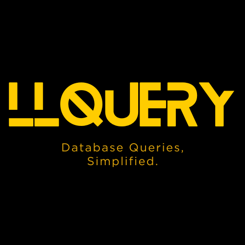
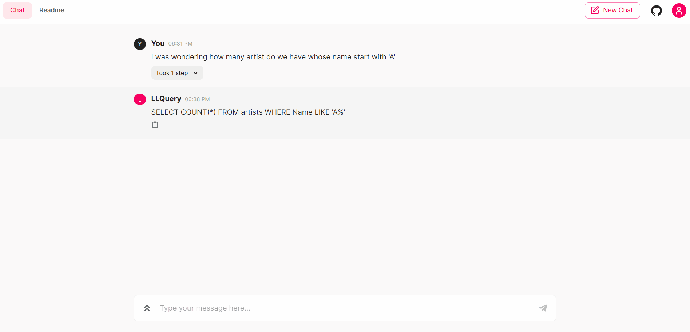
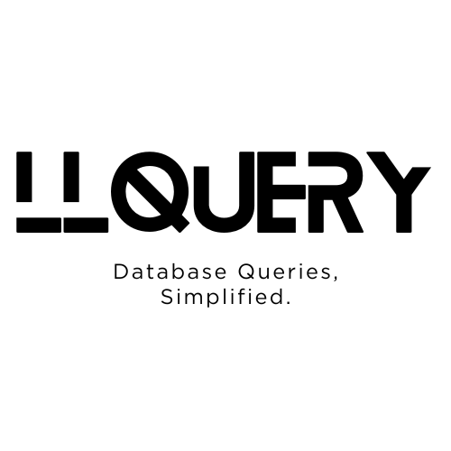
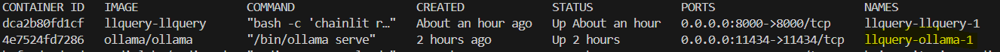

# LLQuery 🚀🤖  

 

 

## 🔐 LLQuery : Your Conversational SQL Bridge

## Project Overview

Harness the power of natural language to effortlessly craft SQL queries with LLQuery. This innovative chatbot, built for Docker, empowers users of all technical backgrounds to interact with their databases intuitively.

Leveraging the cutting-edge capabilities of large language models, LLQuery bridges the gap between human thought and database syntax. Simply ask your question in plain language, and LLQuery will translate it into an accurate SQL query, ready for execution.

For ease, we have taken a sample **SQLite db**. You can use similar logic for any other database schema. This is a proof of concept on how LLM can be leveraged with DB.

## Use Cases:

- **Streamlined Data Analysis**: Craft complex SQL queries with ease, empowering data-driven insights.
- **Simplified Database Interaction**: Non-technical users can now access and manipulate databases effectively.
- **Enhanced Productivity**: Save valuable time by eliminating the need to manually write intricate SQL code.
- **Democratized Data Access**: Empower everyone to unlock the potential of their databases.
- **Educational Tool**: Introduce SQL concepts in a natural and engaging way, fostering data literacy.
- **Customizable Integration**: Seamlessly integrate LLQuery into your existing workflows for optimal efficiency.

### Prerequisites

- [Python 3.11.0](https://www.python.org/downloads/)
- pip 24.0
- Docker version 26.0.0
- I'm on windows so my Docker Compose version is v2.26.1-desktop.1

## Setup Instructions

1. Clone the project repository using Git.
2. Run `docker compose up --build -d`
3. Check container are up `docker ps`

   

4. Install required model for SQL LLM : `docker exec llquery-ollama-1 ollama run duckdb-nsql`

   Read about duckdb-nsql https://ollama.com/library/duckdb-nsql

   

5. If everything goes right, you will be able to access the app at `http://localhost:8000/`.

#### Follow these instructions meticulously to ensure seamless functionality and accurate outcomes.

## Helpful Commands

1. Run Chat app without docker

   - python -m pip install --upgrade pip
   - pip install -r requirements.txt
   - chainlit run app.py -w

2. Test Ollama model is up

   - curl http://localhost:11434/api/tags
   - curl ollama:11434/api/tags

## Note:
Inference speed will depend upon CPU cores and avaialble RAM. It's recomended to have multi core CPU (Laptop / PC) with atleast 16GB RAM. You can deploy it on Server for better performance.

Tested on : 
+ Windows 10
+ i7-10510U CPU @ 1.80GHz 
+ cores : 4
+ RAM : 16GB

## Welcome screen

To modify the welcome screen, edit the `chainlit.md` file at the root of your project. If you do not want a welcome screen, just leave this file empty.
